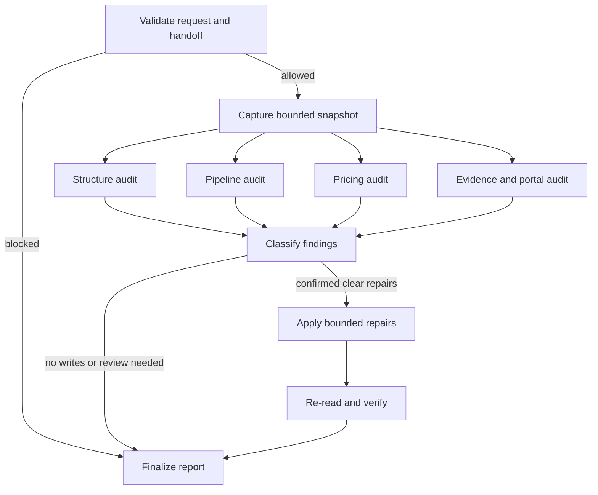

# Architecture

The steward is a compiled LangGraph `StateGraph` with typed shared state and an injected
`WorkbookGateway`. The gateway is the only component allowed to read or mutate Google Sheets.

## Invariants

- Only the fixed Xpress spreadsheet ID is accepted.
- Every run starts with a bounded pre-change snapshot.
- Independent audits fan out and converge before any write decision.
- Findings are either `clear_repair` or `needs_review`.
- Writes require both an exact repair payload and `apply_repairs=true`.
- Every applied change is re-read through the gateway and marked verified or unresolved.
- Incomplete handoffs stop before workbook access.
- Reports always state that no other cells were changed.

## Integration boundary

Implement `WorkbookGateway` with the Google Drive connector. Its snapshot should normalize only
the ranges needed by the graph into `WorkbookSnapshot`; it must not expose credentials or accept
instructions embedded in workbook cells. The adapter should enforce read-before-write, smallest
bounded updates, protection awareness, and post-write reads.

